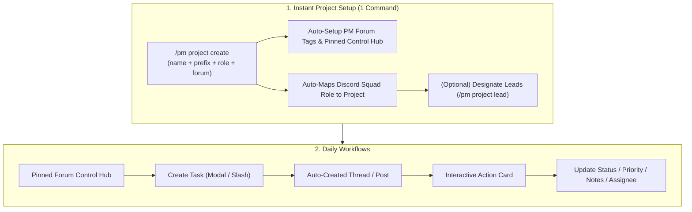

# 🚀 DGG-PM Workflow Guide

This guide walks you through setting up project containers, binding Discord roles and forum channels, and managing day-to-day task execution.

---

## 🏗️ Architecture & Flow Overview



---

## 🛠️ Step-by-Step Setup (Admins & Leads)

### 1. Create a Project & Map Discord Role (1 Step)
In DGG-PM, projects are directly bound to the Discord Server Role representing the functional squad working on that project.

```text
/pm project create name:Mobile App prefix:MOB role:@Mobile Developers channel:#mobile-dev-forum
```

**What the bot does automatically:**
1. **Assigns Squad**: Directly maps `@Mobile Developers` to the project container. Only members holding this role can be assigned to tasks.
2. **Generates Sequential IDs**: Starts task counter with the short prefix (`MOB-1`, `MOB-2`, etc.).
3. **Provisions Forum Tags**: Automatically configures standard PM tags (`⏳ Not Started`, `🟡 In Progress`, `✅ Completed`, `🔴 High`, `🟡 Normal`, `🟢 Low`, `👤 Unassigned`).
4. **Pins Control Hub**: Automatically creates and pins **`📌 📊 Mobile App • Control Hub`** right at the top of the forum channel.

---

### 2. Optional: Designate Team Leads
Assign one or more members holding the project's role as Team Leads:

```text
/pm project lead project_name:Mobile App user:@Alice action:add
```
> [!NOTE]
> Team leads can manage task assignments and mutations for their project. If an admin strips the Discord role from a user in server settings, their lead privileges are revoked immediately and automatically cleaned up.

---

### 3. Optional: Add Additional Roles (Cross-Functional Projects)
If a project needs multiple squads (e.g. adding `@QA` or `@Design`):

```text
/pm project role project_name:Mobile App role:@QA Engineers action:add
```

---

## 💼 Daily Team Workflows

### Option 1: Zero-Command Workflow (Recommended)
You never need to remember or type slash commands for daily work.

1. **Click Pinned Hub**: Navigate to your project forum and click into the pinned `📌 📊 Control Hub`.
2. **Create Task**: Click **`⚡ Tasks Hub`** ➔ **`➕ New Task`** to open the creation modal with project and assignee dropdowns.
3. **Work Inside Task Post**:
   - Each task has its own forum thread post (e.g. `[MOB-1] Implement OAuth login`).
   - Use the **Interactive Action Card** buttons directly in the thread:
     - 🚀 **1-Click Status**: `Start Task`, `In Progress`, `Complete`, `Reopen`.
     - 📝 **Add Note**: Record progress notes and audit events in a popup modal.
     - ✏️ **Edit Details**: Update task title, description, due date, or watchers.
     - 🔗 **Dependencies**: Interactively link/unlink prerequisite and dependent tasks.
     - 🎛️ **Quick Controls**: Access quick dropdowns for assigning members, setting priority (`High`, `Normal`, `Low`), changing due dates, and archiving.

---

### Option 2: Slash Commands (`/pm`)

#### Creating Tasks
```text
/pm task create project_name:Mobile App title:Implement OAuth login assignee:@Bob priority:high due:tomorrow 5pm
```

#### Modifying & Assigning Tasks
- **Assign / Reassign**: `/pm task assign task:MOB-1 assignee:@Bob`
- **Update Status**: `/pm task status task:MOB-1 status:in_progress notes:Started backend endpoint`
- **Audit Trail & History**: `/pm task history task:MOB-1`
- **Archive Task**: `/pm task archive task:MOB-1`

#### Filtered Task Board
```text
/pm task list project_name:Mobile App status:active
```

---

## ⚙️ Personal Settings & Notification Delivery

Team members can customize how and where they receive task assignment and reminder alerts:

```text
/pm settings notify_preference:both
```

- **`dm`**: Receive direct messages from the bot.
- **`channel`**: Receive `@mentions` inside the task thread channel.
- **`both`**: Receive both direct messages and thread channel pings.
- **`silent`**: Silent / no proactive notifications.
