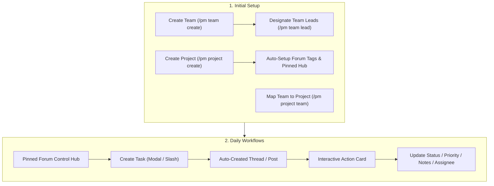

# 🚀 DGG-PM Workflow Guide

This guide walks you through setting up squads, creating project containers, linking forum channels, and managing day-to-day task execution.

---

## 🏗️ Architecture & Flow Overview



---

## 🛠️ Step-by-Step Setup (Admins & Leads)

### 1. Create Functional Teams
Teams in DGG-PM map directly to Discord Server Roles. No manual member syncing is needed.

```text
/pm team create role:@Backend Developers team_name:Backend
```

*(Optional)* Designate Team Leads:
```text
/pm team lead action:add team_name:Backend user:@Alice
```
> [!NOTE]
> Team leads can manage task mutations and assignments for their squads. If an admin strips the Discord role from a user, their lead privileges are revoked immediately.

---

### 2. Create Projects & Bind Channels / Forums
Create a project container and link it to a Discord Forum Channel or Text Channel:

```text
/pm project create name:Mobile App prefix:MOB channel:#mobile-dev-forum
```

**What the bot does automatically:**
1. Generates sequential IDs (`MOB-1`, `MOB-2`, etc.).
2. Provisions standard PM tags in forum channels (`⏳ Not Started`, `🟡 In Progress`, `✅ Completed`, `🔴 High`, `🟡 Normal`, `🟢 Low`).
3. Creates and **pins** an interactive **`📌 📊 Mobile App • Control Hub`** post right at the top of the forum.

---

### 3. Map Teams to the Project
Map which squads are authorized to work on this project container:

```text
/pm project team project_name:Mobile App team_name:Backend action:map
```
*(Task assignments on this project are strictly restricted to members holding mapped team roles).*

---

## 💼 Daily Team Workflows

### Option 1: Zero-Command Workflow (Recommended)
You never need to remember or type slash commands for daily work.

1. **Click Pinned Hub**: Navigate to your project forum and click into the pinned `📌 📊 Control Hub`.
2. **Create Task**: Click **`⚡ Tasks Hub`** ➔ **`➕ New Task`** to open the creation modal with project and assignee dropdowns.
3. **Work Inside Task Post**:
   - Each task has its own forum thread post (e.g. `[MOB-1] Implement OAuth login`).
   - Use the **Interactive Action Card** buttons directly in the thread:
     - 🔄 **Status**: Change to `🟡 In Progress` or `✅ Completed`.
     - ⚡ **Priority**: Set to `🔴 High`, `🟡 Normal`, or `🟢 Low`.
     - 👤 **Reassign**: Select from eligible team role holders.
     - 📅 **Due Date**: Quick preset or natural date.
     - 📝 **Add Note**: Record progress notes and audit events.

---

### Option 2: Slash Commands (`/pm`)

#### Creating Tasks
```text
/pm task create project_name:Mobile App title:Implement OAuth login assignee:@Bob priority:high due:tomorrow 5pm
```

#### Modifying & Assigning Tasks
- **Assign / Reassign**: `/pm task assign task:MOB-1 assignee:@Bob`
- **Update Status**: `/pm task status task:MOB-1 status:in_progress notes:Started backend endpoint`
- **Audit Trail & History**: `/pm task history task:MOB-1`
- **Archive Task**: `/pm task archive task:MOB-1`

#### Filtered Task Board
```text
/pm task list project_name:Mobile App status:active
```

---

## ⚙️ Personal Settings & Notification Delivery

Team members can customize how and where they receive task assignment and reminder alerts:

```text
/pm settings notify_preference:both
```

- **`dm`**: Receive direct messages from the bot.
- **`channel`**: Receive `@mentions` inside the task thread channel.
- **`both`**: Receive both direct messages and thread channel pings.
- **`silent`**: Silent / no proactive notifications.
